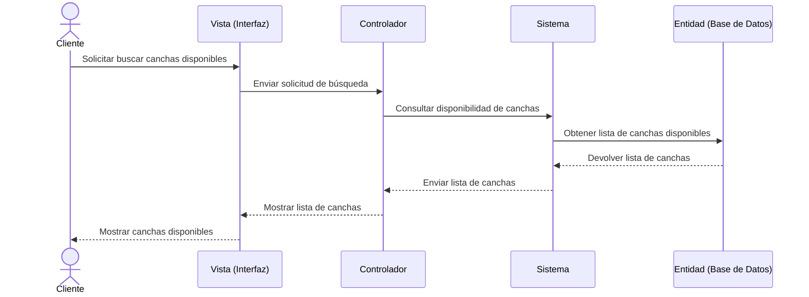

```mermaid
sequenceDiagram
    actor Cliente
    participant Vista as Vista (Interfaz)
    participant Controlador as Controlador
    participant Sistema as Sistema
    participant Entidad as Entidad (Base de Datos)
    
    Cliente->>Vista: Solicitar buscar canchas disponibles
    Vista->>Controlador: Enviar solicitud de búsqueda
    Controlador->>Sistema: Consultar disponibilidad de canchas
    Sistema->>Entidad: Obtener lista de canchas disponibles
    Entidad-->>Sistema: Devolver lista de canchas
    Sistema-->>Controlador: Enviar lista de canchas
    Controlador-->>Vista: Mostrar lista de canchas
    Vista-->>Cliente: Mostrar canchas disponibles


```