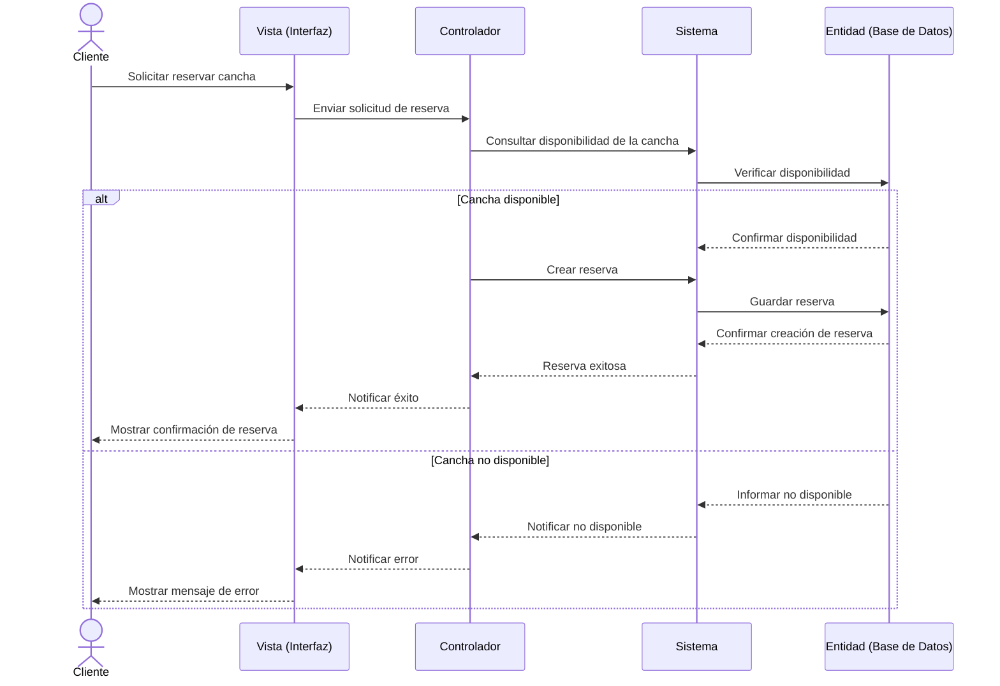

```mermaid

sequenceDiagram
    actor Cliente
    participant Vista as Vista (Interfaz)
    participant Controlador as Controlador
    participant Sistema as Sistema
    participant Entidad as Entidad (Base de Datos)

    Cliente->>Vista: Solicitar reservar cancha
    Vista->>Controlador: Enviar solicitud de reserva
    Controlador->>Sistema: Consultar disponibilidad de la cancha
    Sistema->>Entidad: Verificar disponibilidad
    alt Cancha disponible
        Entidad-->>Sistema: Confirmar disponibilidad
        Controlador->>Sistema: Crear reserva
        Sistema->>Entidad: Guardar reserva
        Entidad-->>Sistema: Confirmar creación de reserva
        Sistema-->>Controlador: Reserva exitosa
        Controlador-->>Vista: Notificar éxito
        Vista-->>Cliente: Mostrar confirmación de reserva
    else Cancha no disponible
        Entidad-->>Sistema: Informar no disponible
        Sistema-->>Controlador: Notificar no disponible
        Controlador-->>Vista: Notificar error
        Vista-->>Cliente: Mostrar mensaje de error
    end


```