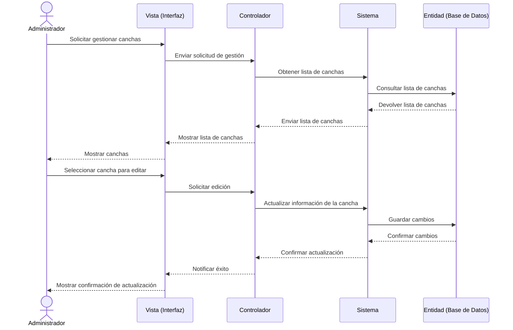

```mermaid

sequenceDiagram
    actor Administrador
    participant Vista as Vista (Interfaz)
    participant Controlador as Controlador
    participant Sistema as Sistema
    participant Entidad as Entidad (Base de Datos)

    Administrador->>Vista: Solicitar gestionar canchas
    Vista->>Controlador: Enviar solicitud de gestión
    Controlador->>Sistema: Obtener lista de canchas
    Sistema->>Entidad: Consultar lista de canchas
    Entidad-->>Sistema: Devolver lista de canchas
    Sistema-->>Controlador: Enviar lista de canchas
    Controlador-->>Vista: Mostrar lista de canchas
    Vista-->>Administrador: Mostrar canchas
    Administrador->>Vista: Seleccionar cancha para editar
    Vista->>Controlador: Solicitar edición
    Controlador->>Sistema: Actualizar información de la cancha
    Sistema->>Entidad: Guardar cambios
    Entidad-->>Sistema: Confirmar cambios
    Sistema-->>Controlador: Confirmar actualización
    Controlador-->>Vista: Notificar éxito
    Vista-->>Administrador: Mostrar confirmación de actualización


```