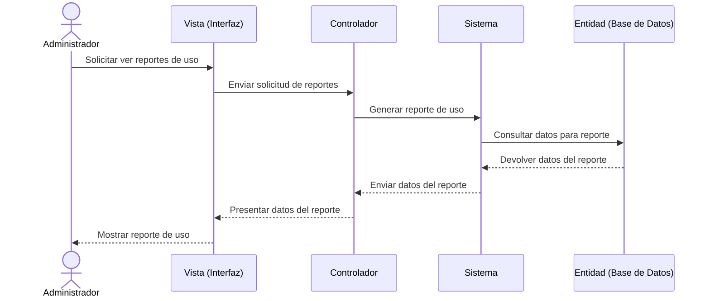

```mermaid

sequenceDiagram
    actor Administrador
    participant Vista as Vista (Interfaz)
    participant Controlador as Controlador
    participant Sistema as Sistema
    participant Entidad as Entidad (Base de Datos)

    Administrador->>Vista: Solicitar ver reportes de uso
    Vista->>Controlador: Enviar solicitud de reportes
    Controlador->>Sistema: Generar reporte de uso
    Sistema->>Entidad: Consultar datos para reporte
    Entidad-->>Sistema: Devolver datos del reporte
    Sistema-->>Controlador: Enviar datos del reporte
    Controlador-->>Vista: Presentar datos del reporte
    Vista-->>Administrador: Mostrar reporte de uso


```