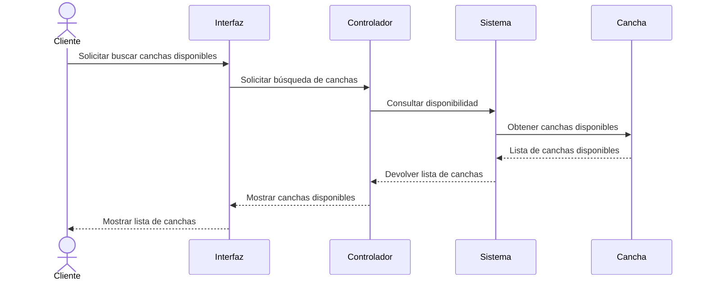

```mermaid

sequenceDiagram
    actor Cliente
    participant Interfaz as Interfaz
    participant Controlador as Controlador
    participant Sistema as Sistema
    participant Cancha as Cancha

    Cliente->>Interfaz: Solicitar buscar canchas disponibles
    Interfaz->>Controlador: Solicitar búsqueda de canchas
    Controlador->>Sistema: Consultar disponibilidad
    Sistema->>Cancha: Obtener canchas disponibles
    Cancha-->>Sistema: Lista de canchas disponibles
    Sistema-->>Controlador: Devolver lista de canchas
    Controlador-->>Interfaz: Mostrar canchas disponibles
    Interfaz-->>Cliente: Mostrar lista de canchas

```