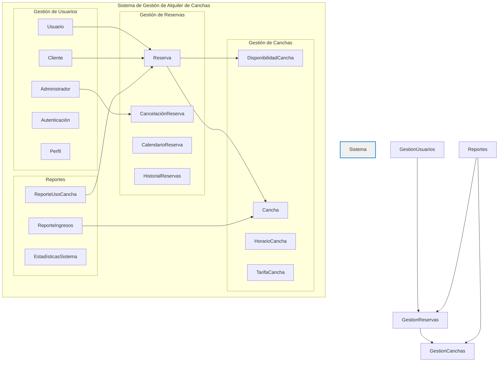

```mermaid


%%{ init : { "theme" : "default", "themeVariables": { "classBackground": "#ffffff", "classBorder": "#007acc", "classTextColor": "#333333" } } }%%
graph TD
    subgraph "Sistema de Gestión de Alquiler de Canchas"
        style Sistema fill:#f0f0f0, stroke:#007acc, stroke-width:2px

        subgraph "Gestión de Usuarios" 
            U1[Usuario]
            U2[Cliente]
            U3[Administrador]
            U4[Autenticación]
            U5[Perfil]
        end

        subgraph "Gestión de Reservas" 
            R1[Reserva]
            R2[CalendarioReserva]
            R3[HistorialReservas]
            R4[CancelaciónReserva]
        end

        subgraph "Gestión de Canchas" 
            C1[Cancha]
            C2[DisponibilidadCancha]
            C3[HorarioCancha]
            C4[TarifaCancha]
        end

        subgraph "Reportes" 
            R5[ReporteUsoCancha]
            R6[ReporteIngresos]
            R7[EstadísticasSistema]
        end
    end

    %% Definición de relaciones
    U1 --> R1
    U2 --> R1
    U3 --> R4
    R1 --> C2
    R1 --> C1
    R5 --> R1
    R6 --> C1

    %% Relaciones entre paquetes
    GestionUsuarios --> GestionReservas
    GestionReservas --> GestionCanchas
    Reportes --> GestionReservas
    Reportes --> GestionCanchas


```