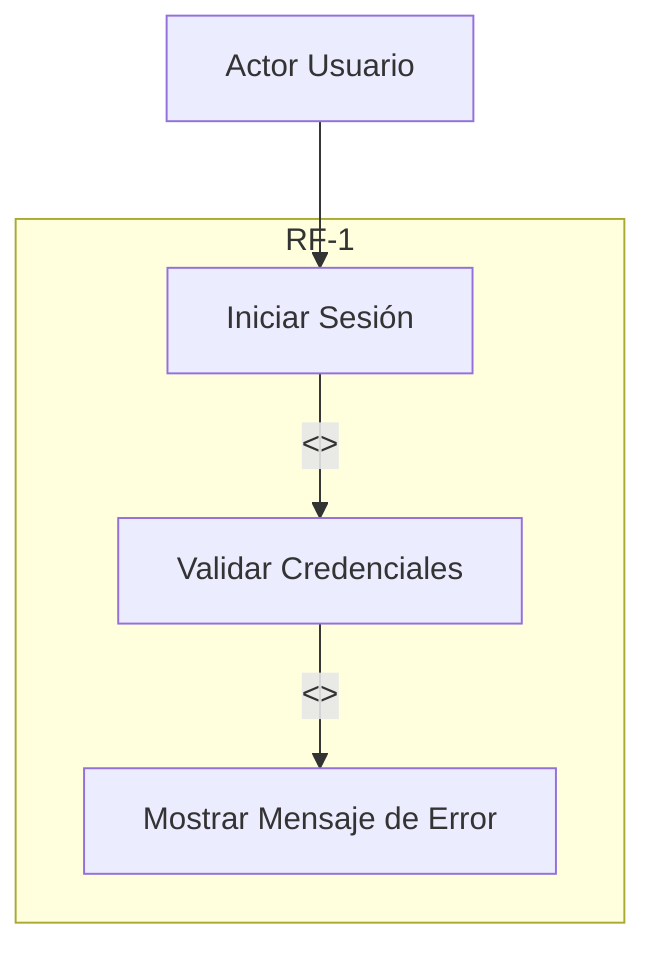

```mermaid

graph TD
  actor[Actor Usuario]

  subgraph RF-1
    A1[Iniciar Sesión]
    A2[Validar Credenciales]
    A3[Mostrar Mensaje de Error] 
  end

  actor --> A1
  A1 -->|<<include>>| A2
  A2 -->|<<extend>>| A3


```
```mermaid
```