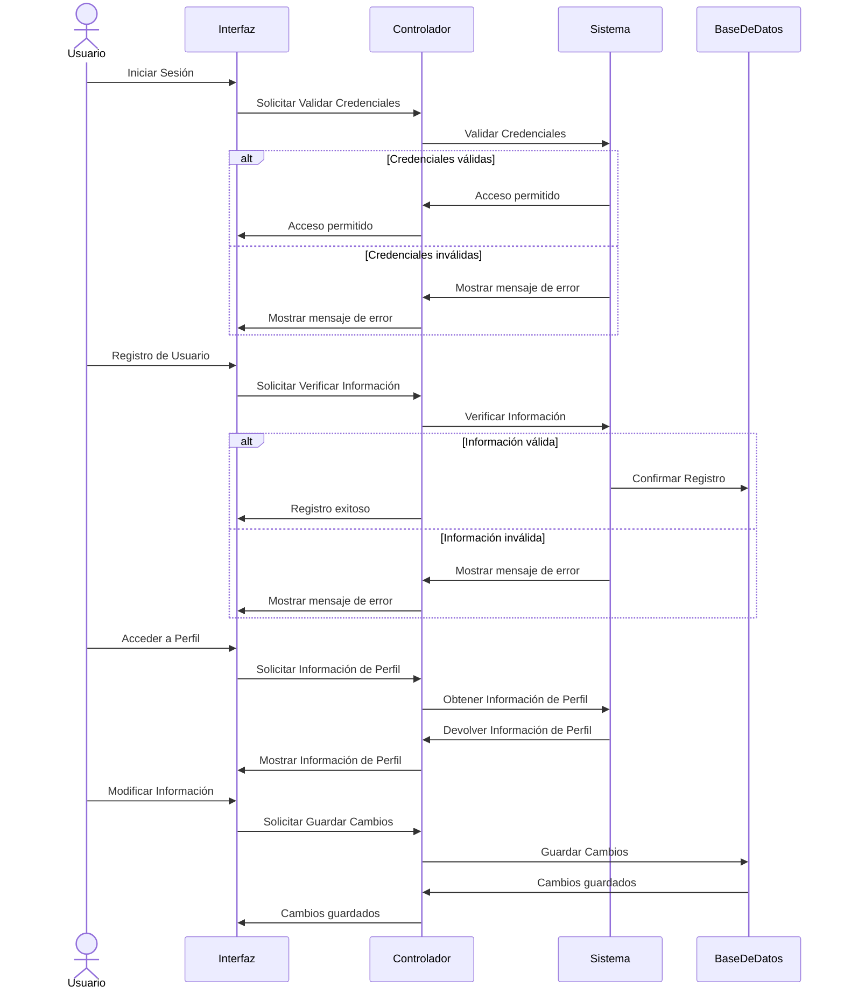

```mermaid

sequenceDiagram
    actor Usuario
    participant Interfaz as Interfaz
    participant Controlador as Controlador
    participant Sistema as Sistema
    participant BaseDeDatos as BaseDeDatos

    Usuario->>Interfaz: Iniciar Sesión
    Interfaz->>Controlador: Solicitar Validar Credenciales
    Controlador->>Sistema: Validar Credenciales
    alt Credenciales válidas
        Sistema->>Controlador: Acceso permitido
        Controlador->>Interfaz: Acceso permitido
    else Credenciales inválidas
        Sistema->>Controlador: Mostrar mensaje de error
        Controlador->>Interfaz: Mostrar mensaje de error
    end

    Usuario->>Interfaz: Registro de Usuario
    Interfaz->>Controlador: Solicitar Verificar Información
    Controlador->>Sistema: Verificar Información
    alt Información válida
        Sistema->>BaseDeDatos: Confirmar Registro
        Controlador->>Interfaz: Registro exitoso
    else Información inválida
        Sistema->>Controlador: Mostrar mensaje de error
        Controlador->>Interfaz: Mostrar mensaje de error
    end

    Usuario->>Interfaz: Acceder a Perfil
    Interfaz->>Controlador: Solicitar Información de Perfil
    Controlador->>Sistema: Obtener Información de Perfil
    Sistema->>Controlador: Devolver Información de Perfil
    Controlador->>Interfaz: Mostrar Información de Perfil
    Usuario->>Interfaz: Modificar Información
    Interfaz->>Controlador: Solicitar Guardar Cambios
    Controlador->>BaseDeDatos: Guardar Cambios
    BaseDeDatos->>Controlador: Cambios guardados
    Controlador->>Interfaz: Cambios guardados


```