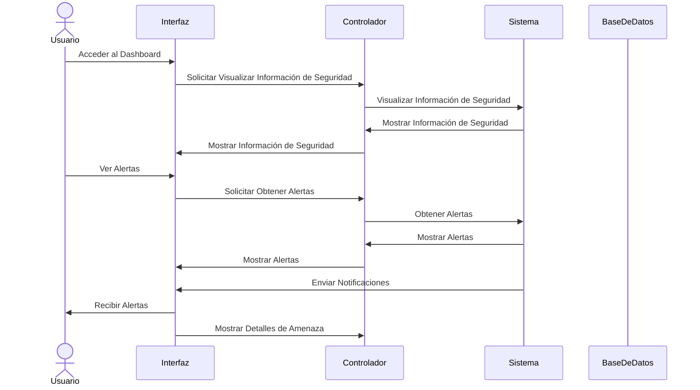

```mermaid


sequenceDiagram
    actor Usuario
    participant Interfaz as Interfaz
    participant Controlador as Controlador
    participant Sistema as Sistema
    participant BaseDeDatos as BaseDeDatos

    Usuario->>Interfaz: Acceder al Dashboard
    Interfaz->>Controlador: Solicitar Visualizar Información de Seguridad
    Controlador->>Sistema: Visualizar Información de Seguridad
    Sistema->>Controlador: Mostrar Información de Seguridad
    Controlador->>Interfaz: Mostrar Información de Seguridad

    Usuario->>Interfaz: Ver Alertas
    Interfaz->>Controlador: Solicitar Obtener Alertas
    Controlador->>Sistema: Obtener Alertas
    Sistema->>Controlador: Mostrar Alertas
    Controlador->>Interfaz: Mostrar Alertas

    Sistema->>Interfaz: Enviar Notificaciones
    Interfaz->>Usuario: Recibir Alertas
    Interfaz->>Controlador: Mostrar Detalles de Amenaza
```