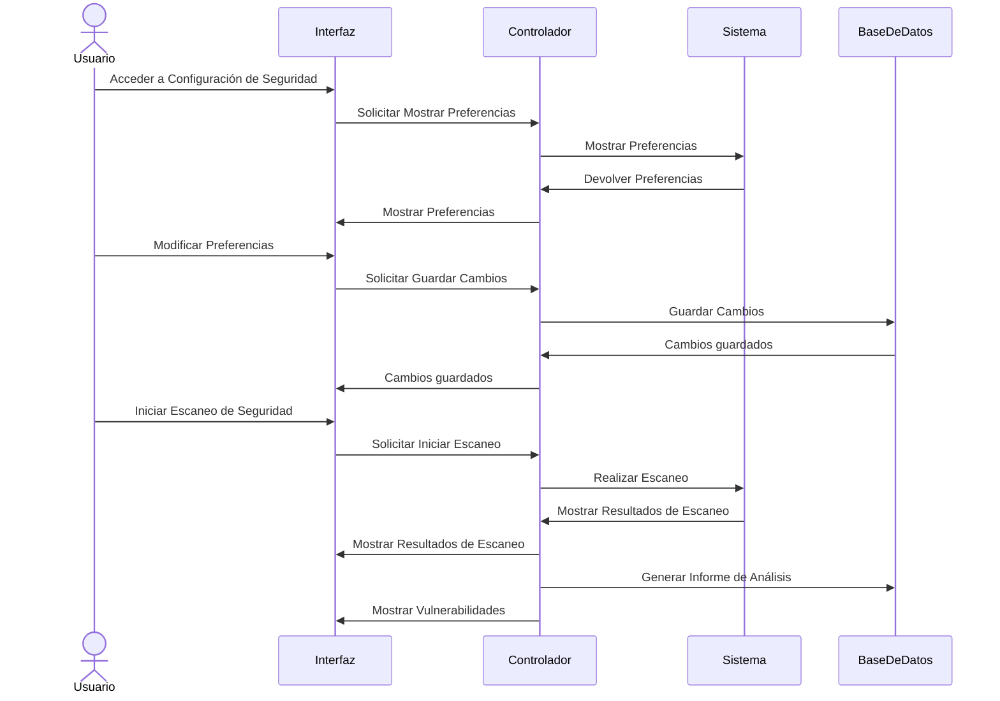

```mermaid

sequenceDiagram
    actor Usuario
    participant Interfaz as Interfaz
    participant Controlador as Controlador
    participant Sistema as Sistema
    participant BaseDeDatos as BaseDeDatos

    Usuario->>Interfaz: Acceder a Configuración de Seguridad
    Interfaz->>Controlador: Solicitar Mostrar Preferencias
    Controlador->>Sistema: Mostrar Preferencias
    Sistema->>Controlador: Devolver Preferencias
    Controlador->>Interfaz: Mostrar Preferencias

    Usuario->>Interfaz: Modificar Preferencias
    Interfaz->>Controlador: Solicitar Guardar Cambios
    Controlador->>BaseDeDatos: Guardar Cambios
    BaseDeDatos->>Controlador: Cambios guardados
    Controlador->>Interfaz: Cambios guardados

    Usuario->>Interfaz: Iniciar Escaneo de Seguridad
    Interfaz->>Controlador: Solicitar Iniciar Escaneo
    Controlador->>Sistema: Realizar Escaneo
    Sistema->>Controlador: Mostrar Resultados de Escaneo
    Controlador->>Interfaz: Mostrar Resultados de Escaneo
    Controlador->>BaseDeDatos: Generar Informe de Análisis
    Controlador->>Interfaz: Mostrar Vulnerabilidades
```