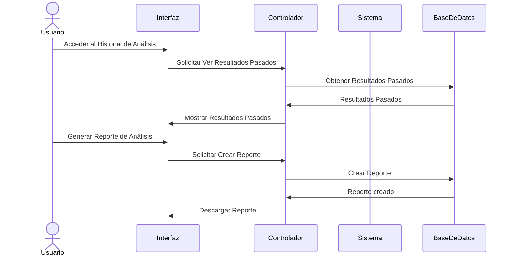

```mermaid

sequenceDiagram
    actor Usuario
    participant Interfaz as Interfaz
    participant Controlador as Controlador
    participant Sistema as Sistema
    participant BaseDeDatos as BaseDeDatos

    Usuario->>Interfaz: Acceder al Historial de Análisis
    Interfaz->>Controlador: Solicitar Ver Resultados Pasados
    Controlador->>BaseDeDatos: Obtener Resultados Pasados
    BaseDeDatos->>Controlador: Resultados Pasados
    Controlador->>Interfaz: Mostrar Resultados Pasados

    Usuario->>Interfaz: Generar Reporte de Análisis
    Interfaz->>Controlador: Solicitar Crear Reporte
    Controlador->>BaseDeDatos: Crear Reporte
    BaseDeDatos->>Controlador: Reporte creado
    Controlador->>Interfaz: Descargar Reporte
```