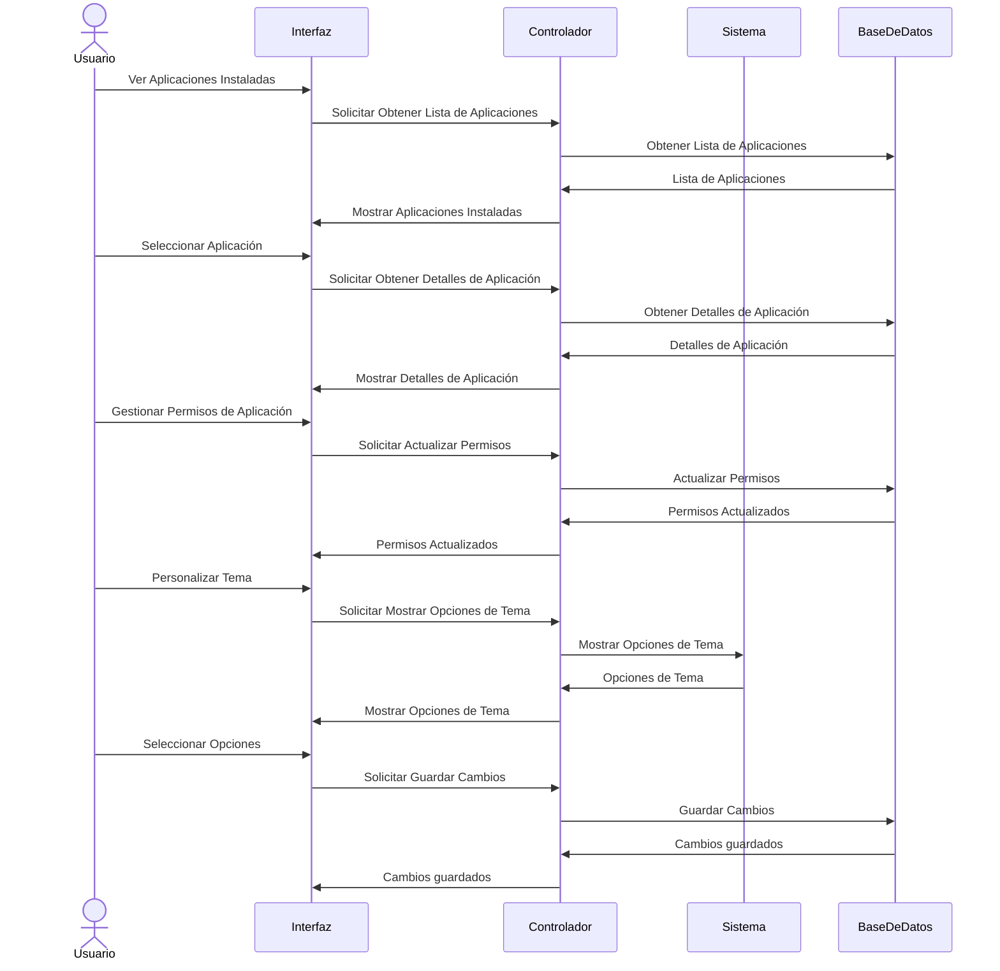

```mermaid

sequenceDiagram
    actor Usuario
    participant Interfaz as Interfaz
    participant Controlador as Controlador
    participant Sistema as Sistema
    participant BaseDeDatos as BaseDeDatos

    Usuario->>Interfaz: Ver Aplicaciones Instaladas
    Interfaz->>Controlador: Solicitar Obtener Lista de Aplicaciones
    Controlador->>BaseDeDatos: Obtener Lista de Aplicaciones
    BaseDeDatos->>Controlador: Lista de Aplicaciones
    Controlador->>Interfaz: Mostrar Aplicaciones Instaladas

    Usuario->>Interfaz: Seleccionar Aplicación
    Interfaz->>Controlador: Solicitar Obtener Detalles de Aplicación
    Controlador->>BaseDeDatos: Obtener Detalles de Aplicación
    BaseDeDatos->>Controlador: Detalles de Aplicación
    Controlador->>Interfaz: Mostrar Detalles de Aplicación

    Usuario->>Interfaz: Gestionar Permisos de Aplicación
    Interfaz->>Controlador: Solicitar Actualizar Permisos
    Controlador->>BaseDeDatos: Actualizar Permisos
    BaseDeDatos->>Controlador: Permisos Actualizados
    Controlador->>Interfaz: Permisos Actualizados

    Usuario->>Interfaz: Personalizar Tema
    Interfaz->>Controlador: Solicitar Mostrar Opciones de Tema
    Controlador->>Sistema: Mostrar Opciones de Tema
    Sistema->>Controlador: Opciones de Tema
    Controlador->>Interfaz: Mostrar Opciones de Tema
    Usuario->>Interfaz: Seleccionar Opciones
    Interfaz->>Controlador: Solicitar Guardar Cambios
    Controlador->>BaseDeDatos: Guardar Cambios
    BaseDeDatos->>Controlador: Cambios guardados
    Controlador->>Interfaz: Cambios guardados


```