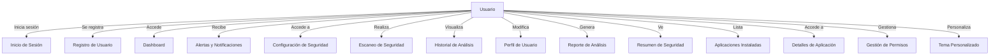

```mermaid

%%{ init : { "theme" : "default" }}}%%
graph TD
    A[Usuario] -->|Inicia sesión| RF1[Inicio de Sesión]
    A -->|Se registra| RF2[Registro de Usuario]
    A -->|Accede| RF3[Dashboard]
    A -->|Recibe| RF4[Alertas y Notificaciones]
    A -->|Accede a| RF5[Configuración de Seguridad]
    A -->|Realiza| RF6[Escaneo de Seguridad]
    A -->|Visualiza| RF7[Historial de Análisis]
    A -->|Modifica| RF8[Perfil de Usuario]
    A -->|Genera| RF9[Reporte de Análisis]
    A -->|Ve| RF10[Resumen de Seguridad]
    A -->|Lista| RF11[Aplicaciones Instaladas]
    A -->|Accede a| RF12[Detalles de Aplicación]
    A -->|Gestiona| RF13[Gestión de Permisos]
    A -->|Personaliza| RF14[Tema Personalizado]


```