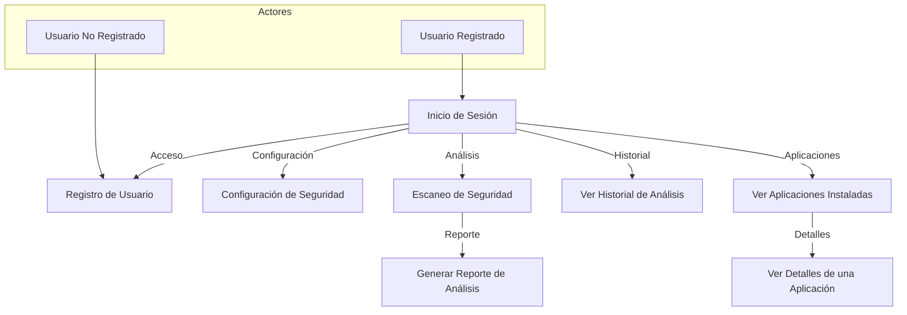

```mermaid

%%{ init : { "theme" : "default", "themeVariables": { "primaryColor": "#ffffff", "edgeLabelBackground":"#ffffff" }}}%%
graph TD
    A[Inicio de Sesión] -->|Acceso| B[Registro de Usuario]
    A -->|Configuración| C[Configuración de Seguridad]
    A -->|Análisis| D[Escaneo de Seguridad]
    A -->|Historial| E[Ver Historial de Análisis]
    A -->|Aplicaciones| F[Ver Aplicaciones Instaladas]
    F -->|Detalles| G[Ver Detalles de una Aplicación]
    D -->|Reporte| H[Generar Reporte de Análisis]

    subgraph "Actores"
        U[Usuario Registrado]
        UR[Usuario No Registrado]
    end

    U --> A
    UR --> B


```