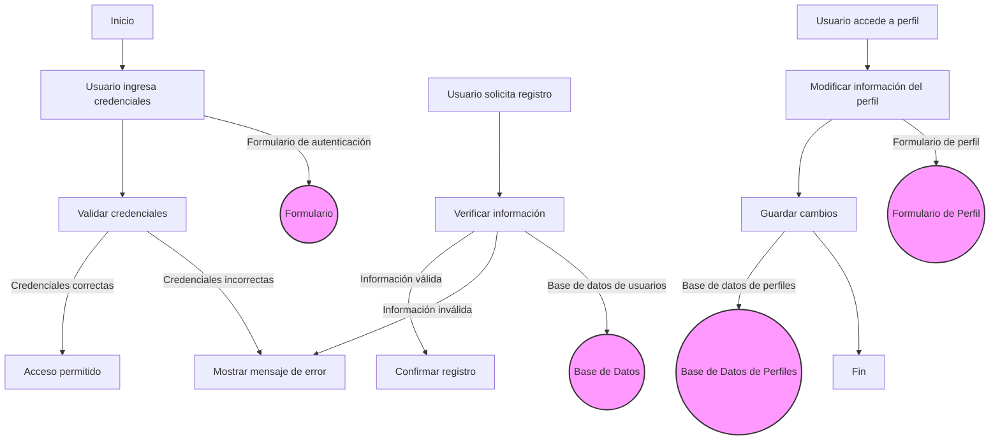

```mermaid

graph TB
    %% Inicio del proceso
    A[Inicio] --> B[Usuario ingresa credenciales]

    %% Validación de credenciales
    B --> C[Validar credenciales]
    C -->|Credenciales correctas| D[Acceso permitido]
    C -->|Credenciales incorrectas| E[Mostrar mensaje de error]

    %% Registro de usuario
    F[Usuario solicita registro] --> G[Verificar información]
    G -->|Información válida| H[Confirmar registro]
    G -->|Información inválida| E[Mostrar mensaje de error]

    %% Acceder a perfil
    I[Usuario accede a perfil] --> J[Modificar información del perfil]
    J --> K[Guardar cambios]

    %% Objetos involucrados
    classDef objeto fill:#f9f,stroke:#333,stroke-width:2px;

    B --> |Formulario de autenticación| O1((Formulario))
    G --> |Base de datos de usuarios| O2((Base de Datos))
    J --> |Formulario de perfil| O3((Formulario de Perfil))
    K --> |Base de datos de perfiles| O4((Base de Datos de Perfiles))
    
    %% Fin del proceso
    K --> L[Fin]
    
    class O1,O2,O3,O4 objeto;


```
