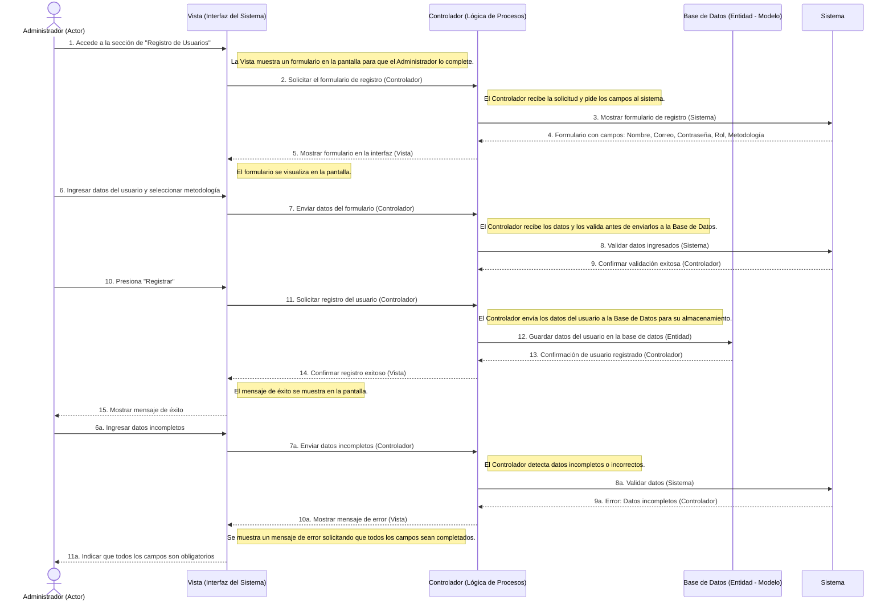

```mermaid

sequenceDiagram
    actor Admin as Administrador (Actor)
    participant Vista as Vista (Interfaz del Sistema)
    participant Controller as Controlador (Lógica de Procesos)
    participant BD as Base de Datos (Entidad - Modelo)
    participant Sistema as Sistema

    %% Inicio del proceso de registro
    Admin->>Vista: 1. Accede a la sección de "Registro de Usuarios"
    Note right of Vista: La Vista muestra un formulario en la pantalla para que el Administrador lo complete.
    Vista->>Controller: 2. Solicitar el formulario de registro (Controlador)
    Note right of Controller: El Controlador recibe la solicitud y pide los campos al sistema.
    Controller->>Sistema: 3. Mostrar formulario de registro (Sistema)
    Sistema-->>Controller: 4. Formulario con campos: Nombre, Correo, Contraseña, Rol, Metodología
    Controller-->>Vista: 5. Mostrar formulario en la interfaz (Vista)
    Note right of Vista: El formulario se visualiza en la pantalla.

    %% Ingreso de datos
    Admin->>Vista: 6. Ingresar datos del usuario y seleccionar metodología
    Vista->>Controller: 7. Enviar datos del formulario (Controlador)
    Note right of Controller: El Controlador recibe los datos y los valida antes de enviarlos a la Base de Datos.
    Controller->>Sistema: 8. Validar datos ingresados (Sistema)
    Sistema-->>Controller: 9. Confirmar validación exitosa (Controlador)

    %% Registro del usuario
    Admin->>Vista: 10. Presiona "Registrar"
    Vista->>Controller: 11. Solicitar registro del usuario (Controlador)
    Note right of Controller: El Controlador envía los datos del usuario a la Base de Datos para su almacenamiento.
    Controller->>BD: 12. Guardar datos del usuario en la base de datos (Entidad)
    BD-->>Controller: 13. Confirmación de usuario registrado (Controlador)
    Controller-->>Vista: 14. Confirmar registro exitoso (Vista)
    Note right of Vista: El mensaje de éxito se muestra en la pantalla.
    Vista-->>Admin: 15. Mostrar mensaje de éxito

    %% Flujo de Excepciones FE1: Datos incompletos
    Admin->>Vista: 6a. Ingresar datos incompletos
    Vista->>Controller: 7a. Enviar datos incompletos (Controlador)
    Note right of Controller: El Controlador detecta datos incompletos o incorrectos.
    Controller->>Sistema: 8a. Validar datos (Sistema)
    Sistema-->>Controller: 9a. Error: Datos incompletos (Controlador)
    Controller-->>Vista: 10a. Mostrar mensaje de error (Vista)
    Note right of Vista: Se muestra un mensaje de error solicitando que todos los campos sean completados.
    Vista-->>Admin: 11a. Indicar que todos los campos son obligatorios


```