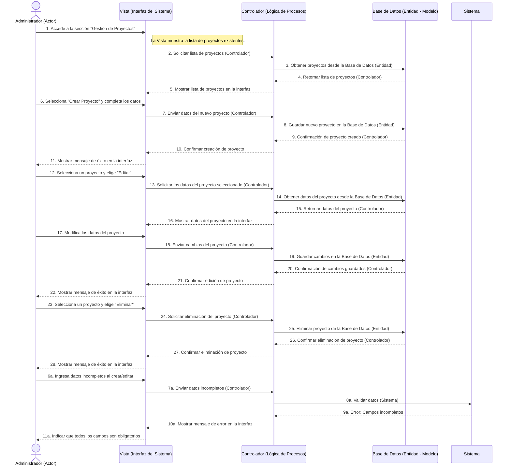

```mermaid

sequenceDiagram
    actor Admin as Administrador (Actor)
    participant Vista as Vista (Interfaz del Sistema)
    participant Controller as Controlador (Lógica de Procesos)
    participant BD as Base de Datos (Entidad - Modelo)
    
    %% Inicio del proceso de gestión de proyectos
    Admin->>Vista: 1. Accede a la sección "Gestión de Proyectos"
    Note right of Vista: La Vista muestra la lista de proyectos existentes.
    Vista->>Controller: 2. Solicitar lista de proyectos (Controlador)
    Controller->>BD: 3. Obtener proyectos desde la Base de Datos (Entidad)
    BD-->>Controller: 4. Retornar lista de proyectos (Controlador)
    Controller-->>Vista: 5. Mostrar lista de proyectos en la interfaz

    %% Crear un nuevo proyecto
    Admin->>Vista: 6. Selecciona "Crear Proyecto" y completa los datos
    Vista->>Controller: 7. Enviar datos del nuevo proyecto (Controlador)
    Controller->>BD: 8. Guardar nuevo proyecto en la Base de Datos (Entidad)
    BD-->>Controller: 9. Confirmación de proyecto creado (Controlador)
    Controller-->>Vista: 10. Confirmar creación de proyecto
    Vista-->>Admin: 11. Mostrar mensaje de éxito en la interfaz

    %% Editar un proyecto existente
    Admin->>Vista: 12. Selecciona un proyecto y elige "Editar"
    Vista->>Controller: 13. Solicitar los datos del proyecto seleccionado (Controlador)
    Controller->>BD: 14. Obtener datos del proyecto desde la Base de Datos (Entidad)
    BD-->>Controller: 15. Retornar datos del proyecto (Controlador)
    Controller-->>Vista: 16. Mostrar datos del proyecto en la interfaz
    Admin->>Vista: 17. Modifica los datos del proyecto
    Vista->>Controller: 18. Enviar cambios del proyecto (Controlador)
    Controller->>BD: 19. Guardar cambios en la Base de Datos (Entidad)
    BD-->>Controller: 20. Confirmación de cambios guardados (Controlador)
    Controller-->>Vista: 21. Confirmar edición de proyecto
    Vista-->>Admin: 22. Mostrar mensaje de éxito en la interfaz

    %% Eliminar un proyecto existente
    Admin->>Vista: 23. Selecciona un proyecto y elige "Eliminar"
    Vista->>Controller: 24. Solicitar eliminación del proyecto (Controlador)
    Controller->>BD: 25. Eliminar proyecto de la Base de Datos (Entidad)
    BD-->>Controller: 26. Confirmar eliminación de proyecto (Controlador)
    Controller-->>Vista: 27. Confirmar eliminación de proyecto
    Vista-->>Admin: 28. Mostrar mensaje de éxito en la interfaz

    %% Flujo de Excepción FE1: Datos incompletos al crear/editar
    Admin->>Vista: 6a. Ingresa datos incompletos al crear/editar
    Vista->>Controller: 7a. Enviar datos incompletos (Controlador)
    Controller->>Sistema: 8a. Validar datos (Sistema)
    Sistema-->>Controller: 9a. Error: Campos incompletos
    Controller-->>Vista: 10a. Mostrar mensaje de error en la interfaz
    Vista-->>Admin: 11a. Indicar que todos los campos son obligatorios


```