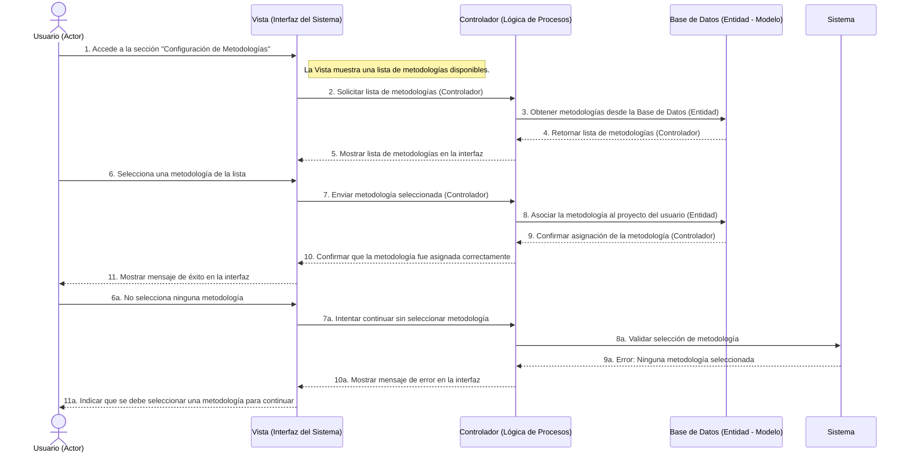

```mermaid

sequenceDiagram
    actor Usuario as Usuario (Actor)
    participant Vista as Vista (Interfaz del Sistema)
    participant Controller as Controlador (Lógica de Procesos)
    participant BD as Base de Datos (Entidad - Modelo)
    
    %% Inicio del proceso de configuración de metodologías
    Usuario->>Vista: 1. Accede a la sección "Configuración de Metodologías"
    Note right of Vista: La Vista muestra una lista de metodologías disponibles.
    Vista->>Controller: 2. Solicitar lista de metodologías (Controlador)
    Controller->>BD: 3. Obtener metodologías desde la Base de Datos (Entidad)
    BD-->>Controller: 4. Retornar lista de metodologías (Controlador)
    Controller-->>Vista: 5. Mostrar lista de metodologías en la interfaz

    %% Selección de metodología
    Usuario->>Vista: 6. Selecciona una metodología de la lista
    Vista->>Controller: 7. Enviar metodología seleccionada (Controlador)
    Controller->>BD: 8. Asociar la metodología al proyecto del usuario (Entidad)
    BD-->>Controller: 9. Confirmar asignación de la metodología (Controlador)
    Controller-->>Vista: 10. Confirmar que la metodología fue asignada correctamente
    Vista-->>Usuario: 11. Mostrar mensaje de éxito en la interfaz

    %% Flujo de Excepción FE1: No se selecciona una metodología
    Usuario->>Vista: 6a. No selecciona ninguna metodología
    Vista->>Controller: 7a. Intentar continuar sin seleccionar metodología
    Controller->>Sistema: 8a. Validar selección de metodología
    Sistema-->>Controller: 9a. Error: Ninguna metodología seleccionada
    Controller-->>Vista: 10a. Mostrar mensaje de error en la interfaz
    Vista-->>Usuario: 11a. Indicar que se debe seleccionar una metodología para continuar

```