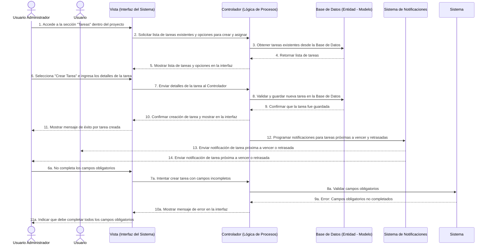

```mermaid

sequenceDiagram
    actor UsuarioAdministrador as Usuario Administrador
    actor Usuario as Usuario
    participant Vista as Vista (Interfaz del Sistema)
    participant Controller as Controlador (Lógica de Procesos)
    participant BD as Base de Datos (Entidad - Modelo)
    participant Notificaciones as Sistema de Notificaciones

    %% Inicio del proceso de gestión de tareas
    UsuarioAdministrador->>Vista: 1. Accede a la sección "Tareas" dentro del proyecto
    Vista->>Controller: 2. Solicitar lista de tareas existentes y opciones para crear y asignar
    Controller->>BD: 3. Obtener tareas existentes desde la Base de Datos
    BD-->>Controller: 4. Retornar lista de tareas
    Controller-->>Vista: 5. Mostrar lista de tareas y opciones en la interfaz

    %% Crear y asignar tareas
    UsuarioAdministrador->>Vista: 6. Selecciona "Crear Tarea" e ingresa los detalles de la tarea
    Vista->>Controller: 7. Enviar detalles de la tarea al Controlador
    Controller->>BD: 8. Validar y guardar nueva tarea en la Base de Datos
    BD-->>Controller: 9. Confirmar que la tarea fue guardada
    Controller-->>Vista: 10. Confirmar creación de tarea y mostrar en la interfaz
    Vista-->>UsuarioAdministrador: 11. Mostrar mensaje de éxito por tarea creada

    %% Notificaciones de tareas
    Controller->>Notificaciones: 12. Programar notificaciones para tareas próximas a vencer y retrasadas
    Notificaciones-->>Usuario: 13. Enviar notificación de tarea próxima a vencer o retrasada
    Notificaciones-->>UsuarioAdministrador: 14. Enviar notificación de tarea próxima a vencer o retrasada

    %% Flujo de Excepción FE1: No se completan campos obligatorios
    UsuarioAdministrador->>Vista: 6a. No completa los campos obligatorios
    Vista->>Controller: 7a. Intentar crear tarea con campos incompletos
    Controller->>Sistema: 8a. Validar campos obligatorios
    Sistema-->>Controller: 9a. Error: Campos obligatorios no completados
    Controller-->>Vista: 10a. Mostrar mensaje de error en la interfaz
    Vista-->>UsuarioAdministrador: 11a. Indicar que debe completar todos los campos obligatorios


```