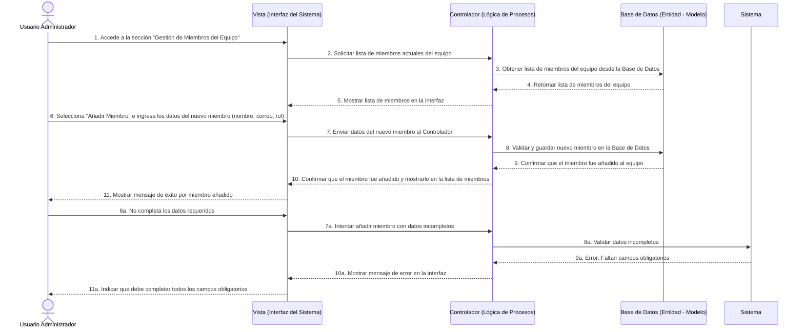

```mermaid

sequenceDiagram
    actor UsuarioAdministrador as Usuario Administrador
    participant Vista as Vista (Interfaz del Sistema)
    participant Controller as Controlador (Lógica de Procesos)
    participant BD as Base de Datos (Entidad - Modelo)

    %% Inicio del proceso de gestión de miembros del equipo
    UsuarioAdministrador->>Vista: 1. Accede a la sección "Gestión de Miembros del Equipo"
    Vista->>Controller: 2. Solicitar lista de miembros actuales del equipo
    Controller->>BD: 3. Obtener lista de miembros del equipo desde la Base de Datos
    BD-->>Controller: 4. Retornar lista de miembros del equipo
    Controller-->>Vista: 5. Mostrar lista de miembros en la interfaz

    %% Añadir nuevo miembro
    UsuarioAdministrador->>Vista: 6. Selecciona "Añadir Miembro" e ingresa los datos del nuevo miembro (nombre, correo, rol)
    Vista->>Controller: 7. Enviar datos del nuevo miembro al Controlador
    Controller->>BD: 8. Validar y guardar nuevo miembro en la Base de Datos
    BD-->>Controller: 9. Confirmar que el miembro fue añadido al equipo
    Controller-->>Vista: 10. Confirmar que el miembro fue añadido y mostrarlo en la lista de miembros
    Vista-->>UsuarioAdministrador: 11. Mostrar mensaje de éxito por miembro añadido

    %% Flujo de Excepción FE1: Campos incompletos al añadir miembro
    UsuarioAdministrador->>Vista: 6a. No completa los datos requeridos
    Vista->>Controller: 7a. Intentar añadir miembro con datos incompletos
    Controller->>Sistema: 8a. Validar datos incompletos
    Sistema-->>Controller: 9a. Error: Faltan campos obligatorios
    Controller-->>Vista: 10a. Mostrar mensaje de error en la interfaz
    Vista-->>UsuarioAdministrador: 11a. Indicar que debe completar todos los campos obligatorios

```