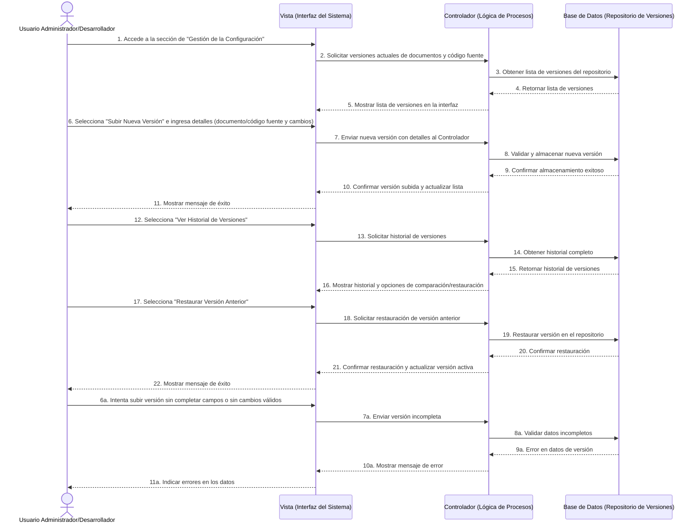

```mermaid

sequenceDiagram

    actor Usuario as Usuario Administrador/Desarrollador
    participant Vista as Vista (Interfaz del Sistema)
    participant Controller as Controlador (Lógica de Procesos)
    participant BD as Base de Datos (Repositorio de Versiones)

    %% Inicio del proceso de gestión de la configuración
    Usuario->>Vista: 1. Accede a la sección de "Gestión de la Configuración"
    Vista->>Controller: 2. Solicitar versiones actuales de documentos y código fuente
    Controller->>BD: 3. Obtener lista de versiones del repositorio
    BD-->>Controller: 4. Retornar lista de versiones
    Controller-->>Vista: 5. Mostrar lista de versiones en la interfaz

    %% Subir nueva versión
    Usuario->>Vista: 6. Selecciona "Subir Nueva Versión" e ingresa detalles (documento/código fuente y cambios)
    Vista->>Controller: 7. Enviar nueva versión con detalles al Controlador
    Controller->>BD: 8. Validar y almacenar nueva versión
    BD-->>Controller: 9. Confirmar almacenamiento exitoso
    Controller-->>Vista: 10. Confirmar versión subida y actualizar lista
    Vista-->>Usuario: 11. Mostrar mensaje de éxito

    %% Visualizar historial y restaurar versiones
    Usuario->>Vista: 12. Selecciona "Ver Historial de Versiones"
    Vista->>Controller: 13. Solicitar historial de versiones
    Controller->>BD: 14. Obtener historial completo
    BD-->>Controller: 15. Retornar historial de versiones
    Controller-->>Vista: 16. Mostrar historial y opciones de comparación/restauración
    Usuario->>Vista: 17. Selecciona "Restaurar Versión Anterior"
    Vista->>Controller: 18. Solicitar restauración de versión anterior
    Controller->>BD: 19. Restaurar versión en el repositorio
    BD-->>Controller: 20. Confirmar restauración
    Controller-->>Vista: 21. Confirmar restauración y actualizar versión activa
    Vista-->>Usuario: 22. Mostrar mensaje de éxito

    %% Flujo de Excepción FE1: Subida de versión sin completar datos
    Usuario->>Vista: 6a. Intenta subir versión sin completar campos o sin cambios válidos
    Vista->>Controller: 7a. Enviar versión incompleta
    Controller->>BD: 8a. Validar datos incompletos
    BD-->>Controller: 9a. Error en datos de versión
    Controller-->>Vista: 10a. Mostrar mensaje de error
    Vista-->>Usuario: 11a. Indicar errores en los datos


```