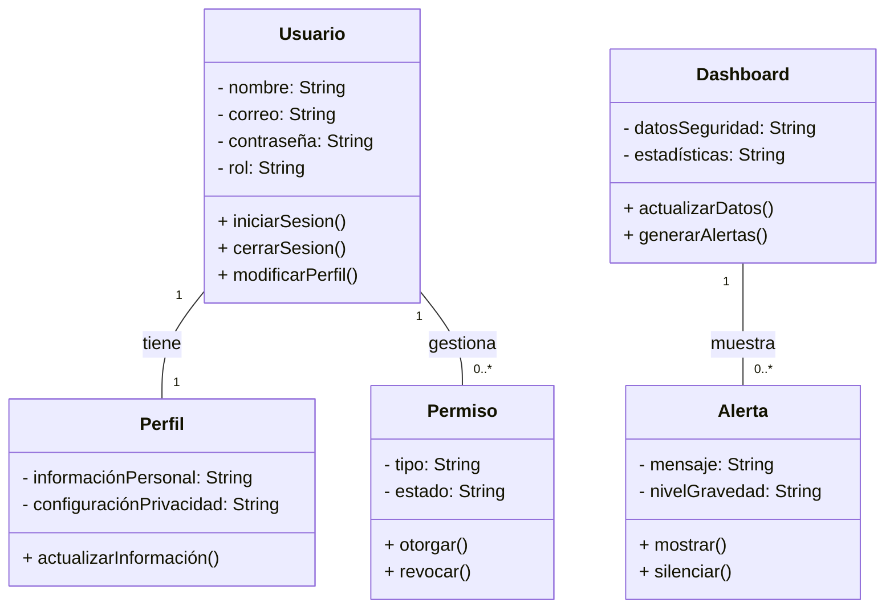

```mermaid


classDiagram
    class Usuario {
        - nombre: String
        - correo: String
        - contraseña: String
        - rol: String
        + iniciarSesion()
        + cerrarSesion()
        + modificarPerfil()
    }

    class Perfil {
        - informaciónPersonal: String
        - configuraciónPrivacidad: String
        + actualizarInformación()
    }

    class Dashboard {
        - datosSeguridad: String
        - estadísticas: String
        + actualizarDatos()
        + generarAlertas()
    }

    class Alerta {
        - mensaje: String
        - nivelGravedad: String
        + mostrar()
        + silenciar()
    }

    class Permiso {
        - tipo: String
        - estado: String
        + otorgar()
        + revocar()
    }

    Usuario "1" -- "1" Perfil : tiene
    Usuario "1" -- "0..*" Permiso : gestiona
    Dashboard "1" -- "0..*" Alerta : muestra


```