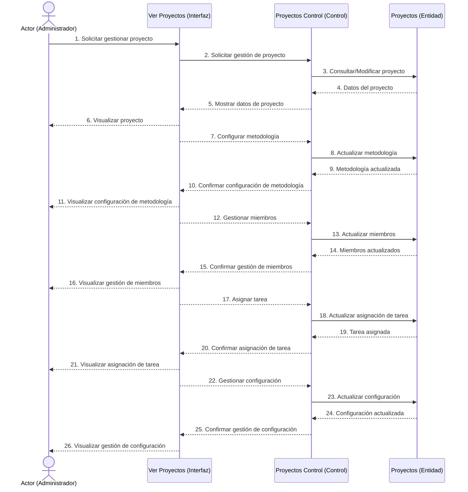

```mermaid
sequenceDiagram
    actor Administrador as Actor (Administrador)
    participant VerProyectos as Ver Proyectos (Interfaz)
    participant ProyectosControl as Proyectos Control (Control)
    participant ProyectosEntidad as Proyectos (Entidad)

    %% Gestionar proyecto
    Administrador->>VerProyectos: 1. Solicitar gestionar proyecto
    VerProyectos->>ProyectosControl: 2. Solicitar gestión de proyecto
    ProyectosControl->>ProyectosEntidad: 3. Consultar/Modificar proyecto
    ProyectosEntidad-->>ProyectosControl: 4. Datos del proyecto
    ProyectosControl-->>VerProyectos: 5. Mostrar datos de proyecto
    VerProyectos-->>Administrador: 6. Visualizar proyecto

    %% Inclusiones desde gestionar proyecto

    %% Configurar metodología
    VerProyectos-->>ProyectosControl: 7. Configurar metodología
    ProyectosControl->>ProyectosEntidad: 8. Actualizar metodología
    ProyectosEntidad-->>ProyectosControl: 9. Metodología actualizada
    ProyectosControl-->>VerProyectos: 10. Confirmar configuración de metodología
    VerProyectos-->>Administrador: 11. Visualizar configuración de metodología

    %% Gestionar miembros
    VerProyectos-->>ProyectosControl: 12. Gestionar miembros
    ProyectosControl->>ProyectosEntidad: 13. Actualizar miembros
    ProyectosEntidad-->>ProyectosControl: 14. Miembros actualizados
    ProyectosControl-->>VerProyectos: 15. Confirmar gestión de miembros
    VerProyectos-->>Administrador: 16. Visualizar gestión de miembros

    %% Asignar tarea
    VerProyectos-->>ProyectosControl: 17. Asignar tarea
    ProyectosControl->>ProyectosEntidad: 18. Actualizar asignación de tarea
    ProyectosEntidad-->>ProyectosControl: 19. Tarea asignada
    ProyectosControl-->>VerProyectos: 20. Confirmar asignación de tarea
    VerProyectos-->>Administrador: 21. Visualizar asignación de tarea

    %% Gestionar configuración
    VerProyectos-->>ProyectosControl: 22. Gestionar configuración
    ProyectosControl->>ProyectosEntidad: 23. Actualizar configuración
    ProyectosEntidad-->>ProyectosControl: 24. Configuración actualizada
    ProyectosControl-->>VerProyectos: 25. Confirmar gestión de configuración
    VerProyectos-->>Administrador: 26. Visualizar gestión de configuración


```
