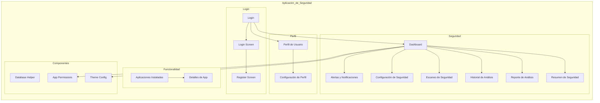

```mermaid

graph TD
  %% Paquete principal
  subgraph Aplicación_de_Seguridad
    direction TB

    subgraph Login
      A1[Login] --> A2[Login Screen]
      A2 --> A3[Register Screen]
    end

    subgraph Seguridad
      D1[Dashboard]
      D2[Alertas y Notificaciones]
      D3[Configuración de Seguridad]
      D4[Escaneo de Seguridad]
      D5[Historial de Análisis]
      D6[Reporte de Análisis]
      D7[Resumen de Seguridad]
    end

    subgraph Funcionalidad
      F1[Aplicaciones Instaladas] --> F2[Detalles de App]
    end

    subgraph Perfil
      P1[Perfil de Usuario] --> P2[Configuración de Perfil]
    end

    subgraph Componentes
      C1[Database Helper]
      C2[App Permissions]
      C3[Theme Config]
    end
  end

  %% Relaciones
  A1 --> D1
  A1 --> P1
  D1 --> C2
  D1 --> C3

  %% Conexiones dentro de Seguridad
  D1 --> D2
  D1 --> D3
  D1 --> D4
  D1 --> D5
  D1 --> D6
  D1 --> D7


```
