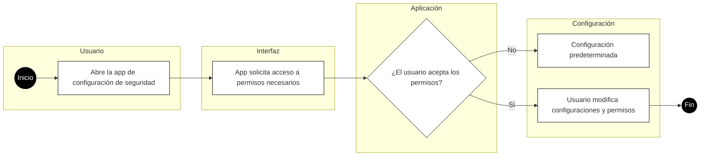

```mermaid

flowchart LR
    %% Usuario
    subgraph Usuario
        A((Inicio)) --> B[Abre la app de configuración de seguridad]
    end

    %% Interfaz
    subgraph Interfaz
        B --> C[App solicita acceso a permisos necesarios]
    end

    %% Aplicación
    subgraph Aplicación
        C --> D{¿El usuario acepta los permisos?}
    end

    %% Configuración
    subgraph Configuración
        D -->|No| E[Configuración predeterminada]
        D -->|Sí| F[Usuario modifica configuraciones y permisos]
    end

    %% Finalización
    F --> G((Fin))

    classDef default fill:#fff,stroke:#000,stroke-width:1px;
    classDef start_end fill:#000,stroke:#fff,stroke-width:1px,color:#fff;
    class A,G start_end;
    class D decision;


```
