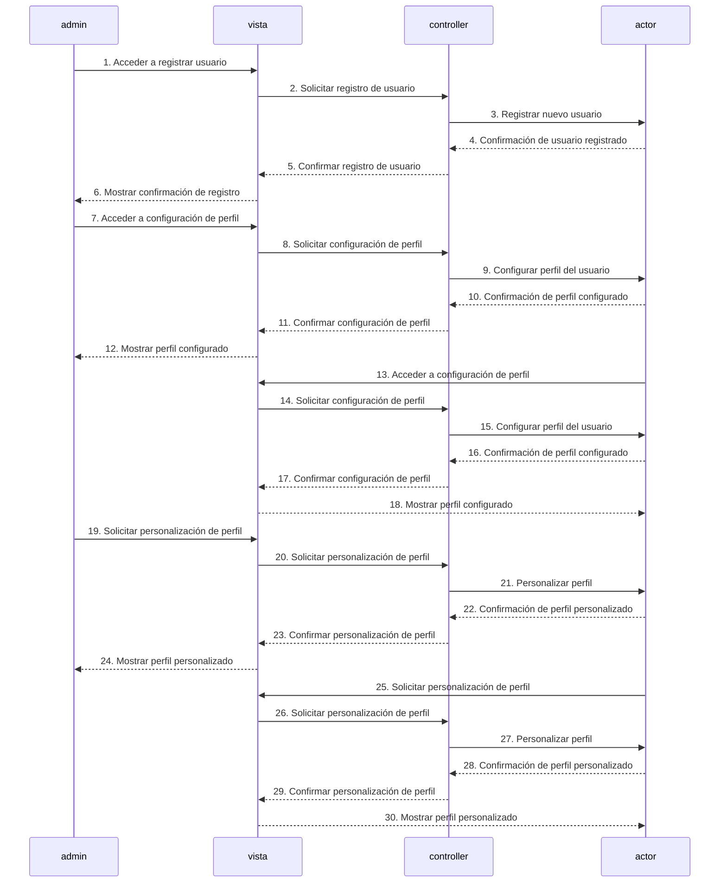

```mermaid
sequenceDiagram
    participant Admin as admin
    participant Vista as vista
    participant Controller as controller
    participant Usuario as actor

    %% Registro de Usuario por Administrador
    Admin->>Vista: 1. Acceder a registrar usuario
    Vista->>Controller: 2. Solicitar registro de usuario
    Controller->>Usuario: 3. Registrar nuevo usuario
    Usuario-->>Controller: 4. Confirmación de usuario registrado
    Controller-->>Vista: 5. Confirmar registro de usuario
    Vista-->>Admin: 6. Mostrar confirmación de registro

    %% Configuración de Perfil por Administrador y Usuario
    Admin->>Vista: 7. Acceder a configuración de perfil
    Vista->>Controller: 8. Solicitar configuración de perfil
    Controller->>Usuario: 9. Configurar perfil del usuario
    Usuario-->>Controller: 10. Confirmación de perfil configurado
    Controller-->>Vista: 11. Confirmar configuración de perfil
    Vista-->>Admin: 12. Mostrar perfil configurado

    Usuario->>Vista: 13. Acceder a configuración de perfil
    Vista->>Controller: 14. Solicitar configuración de perfil
    Controller->>Usuario: 15. Configurar perfil del usuario
    Usuario-->>Controller: 16. Confirmación de perfil configurado
    Controller-->>Vista: 17. Confirmar configuración de perfil
    Vista-->>Usuario: 18. Mostrar perfil configurado

    %% Personalización de Perfil
    Admin->>Vista: 19. Solicitar personalización de perfil
    Vista->>Controller: 20. Solicitar personalización de perfil
    Controller->>Usuario: 21. Personalizar perfil
    Usuario-->>Controller: 22. Confirmación de perfil personalizado
    Controller-->>Vista: 23. Confirmar personalización de perfil
    Vista-->>Admin: 24. Mostrar perfil personalizado

    Usuario->>Vista: 25. Solicitar personalización de perfil
    Vista->>Controller: 26. Solicitar personalización de perfil
    Controller->>Usuario: 27. Personalizar perfil
    Usuario-->>Controller: 28. Confirmación de perfil personalizado
    Controller-->>Vista: 29. Confirmar personalización de perfil
    Vista-->>Usuario: 30. Mostrar perfil personalizado

```
