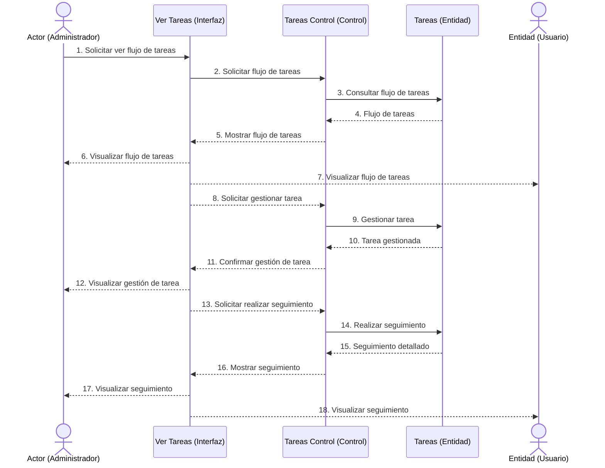

```mermaid
sequenceDiagram
    actor Administrador as Actor (Administrador)
    participant VerTareas as Ver Tareas (Interfaz)
    participant TareasControl as Tareas Control (Control)
    participant TareasEntidad as Tareas (Entidad)
    actor Usuario as Entidad (Usuario)

    %% Ver flujo de tareas
    Administrador->>VerTareas: 1. Solicitar ver flujo de tareas
    VerTareas->>TareasControl: 2. Solicitar flujo de tareas
    TareasControl->>TareasEntidad: 3. Consultar flujo de tareas
    TareasEntidad-->>TareasControl: 4. Flujo de tareas
    TareasControl-->>VerTareas: 5. Mostrar flujo de tareas
    VerTareas-->>Administrador: 6. Visualizar flujo de tareas
    VerTareas-->>Usuario: 7. Visualizar flujo de tareas

    %% Extensiones desde flujo de tareas

    %% Gestionar tarea
    VerTareas-->>TareasControl: 8. Solicitar gestionar tarea
    TareasControl->>TareasEntidad: 9. Gestionar tarea
    TareasEntidad-->>TareasControl: 10. Tarea gestionada
    TareasControl-->>VerTareas: 11. Confirmar gestión de tarea
    VerTareas-->>Administrador: 12. Visualizar gestión de tarea

    %% Realizar seguimiento
    VerTareas-->>TareasControl: 13. Solicitar realizar seguimiento
    TareasControl->>TareasEntidad: 14. Realizar seguimiento
    TareasEntidad-->>TareasControl: 15. Seguimiento detallado
    TareasControl-->>VerTareas: 16. Mostrar seguimiento
    VerTareas-->>Administrador: 17. Visualizar seguimiento
    VerTareas-->>Usuario: 18. Visualizar seguimiento

```
