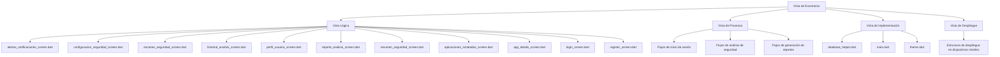

```mermaid
graph TD
    A[Vista de Escenarios] --> B[Vista Lógica]
    A --> C[Vista de Procesos]
    A --> D[Vista de Implementación]
    A --> E[Vista de Despliegue]

    B --> F[alertas_notificaciones_screen.dart]
    B --> G[configuracion_seguridad_screen.dart]
    B --> H[escaneo_seguridad_screen.dart]
    B --> I[historial_analisis_screen.dart]
    B --> J[perfil_usuario_screen.dart]
    B --> K[reporte_analisis_screen.dart]
    B --> L[resumen_seguridad_screen.dart]
    B --> M[aplicaciones_instaladas_screen.dart]
    B --> N[app_details_screen.dart]
    B --> O[login_screen.dart]
    B --> P[register_screen.dart]

    D --> Q[database_helper.dart]
    D --> R[main.dart]
    D --> S[theme.dart]

    C --> T[Flujos de inicio de sesión]
    C --> U[Flujos de análisis de seguridad]
    C --> V[Flujos de generación de reportes]

    E --> W[Estructura de despliegue en dispositivos móviles]


```