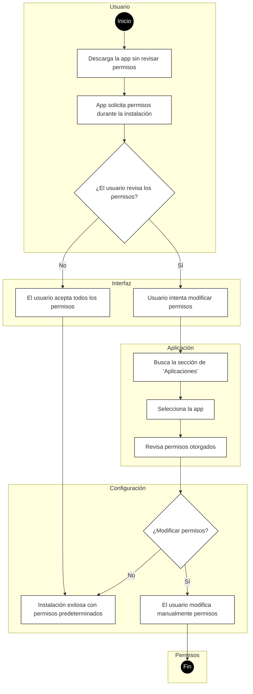

```mermaid

flowchart TD
    subgraph Usuario
        A((Inicio)) --> B[Descarga la app sin revisar permisos]
        B --> C[App solicita permisos durante la instalación]
        C --> D{¿El usuario revisa los permisos?}
    end

    subgraph Interfaz
        D -->|No| E[El usuario acepta todos los permisos]
        D -->|Sí| F[Usuario intenta modificar permisos]
    end

    subgraph Aplicación
        F --> G[Busca la sección de 'Aplicaciones']
        G --> H[Selecciona la app]
        H --> I[Revisa permisos otorgados]
    end

    subgraph Configuración
        I --> J{¿Modificar permisos?}
        J -->|No| K[Instalación exitosa con permisos predeterminados]
        J -->|Sí| L[El usuario modifica manualmente permisos]
    end

    subgraph Permisos
        L --> M((Fin))
        E --> K
    end

    classDef default fill:#fff,stroke:#000,stroke-width:1px;
    classDef start_end fill:#000,stroke:#fff,stroke-width:1px,color:#fff;
    class A,M start_end;
    class D,J decision;


```
